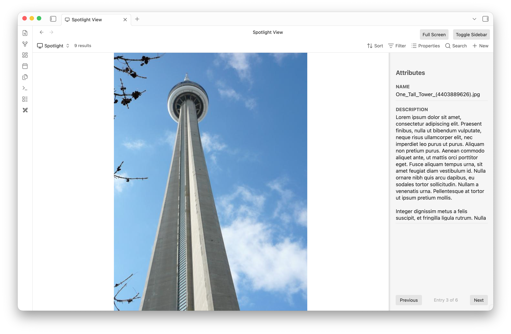

# Obsidian Bases Spotlight View for Obsidian

**Obsidian Bases Spotlight View** is a powerful plugin that integrates tightly with the Obsidian [Bases](https://github.com/obsidianmd/bases) framework. It provides a beautiful, dual-pane "Spotlight" view specifically designed for rapidly browsing, tagging, and managing structured metadata for files in your vault.

Whether you're organizing a collection of PDFs, sorting a gallery of images, or just blazing through notes, Spotlight View gives you a distraction-free, highly interactive interface.



## Features

- **Dual-Pane Interface**: A massive center viewing area to read or view the file, accompanied by a sleek right sidebar focused exclusively on its metadata properties.
- **Native Media Rendering**: Flawlessly renders Markdown notes, edge-to-edge Images, and fully interactive PDFs directly in the center pane.
- **Shadow Markdown Sidecars**: Easily tag binary files! If you assign properties to an Image or PDF, the plugin transparently generates a `.md` sidecar file to store the metadata natively without cluttering your view.
- **Custom Content Properties**: Override the center pane to render a specific text property instead of the file content. Spotlight automatically parses standard Obsidian `[[Wikilinks]]` in your properties to seamlessly render the linked files!
- **Interactive Sidebar**:
  - **Inline Editing**: Click any property value to quickly edit its contents without opening any modal dialogs.
  - **Drag-and-Drop Reordering**: Grab any property's name header to drag and reorder the layout to your exact preferences.
  - **Custom Heights**: Grab the divider below any property to dynamically resize its height (perfect for long text fields). Layout changes are persisted globally!

## How to Use

1. Install the plugin alongside the **Bases** plugin.
2. In any Base view, switch the view type to **Spotlight View**.
3. Use the pagination controls (or arrow keys) to quickly cycle through the files returned by your Base's query.
4. Customize your experience via the Base View Options (e.g., configuring the **Spotlight Content Property**). *Note: To use the Spotlight Content Property successfully, you must use a standard `[[]]` reference to a file in the property.*

## Development

To build this plugin locally:

```bash
npm install
npm run build
```

This will compile `main.ts` into `main.js` which Obsidian requires to load the plugin. Ensure your Obsidian vault has the plugin enabled in Community Plugins.
